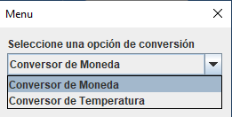
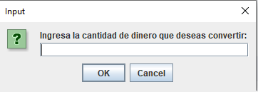
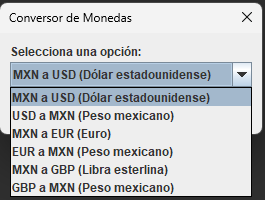
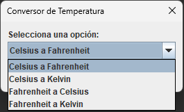

# Conversor de Monedas y Temperaturas

## Descripción

Este es un proyecto de un conversor de monedas y temperaturas desarrollado en Java. El programa permite realizar conversiones entre diferentes monedas y escalas de temperatura.

## Funcionalidades

- Conversor de Monedas:

  

- Conversor de Temperaturas:
.

## Capturas de Pantalla

## Requisitos

- Java Development Kit (JDK) 8 o superior.
- IDE de Java (por ejemplo, Eclipse, IntelliJ) o un editor de texto.

## Cómo usar

1. Clona el repositorio o descarga los archivos del proyecto.
2. Abre el proyecto en tu IDE de Java o editor de texto.
3. Ejecuta la clase `PantallaPrincipal` para iniciar el programa.
4. Selecciona una opción entre "Conversor de monedas" y "Conversor de temperatura".
5. Sigue las instrucciones para realizar las conversiones.

